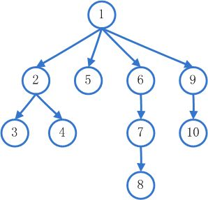

#### 广度优先算法


* 深度优先遍历
* 广度优先遍历

`广度优先搜索`的核心思想是：
从初始节点开始，
应用算符生成第一层节点，检查目标节点是否在这些后继节点中，
若没有，再用产生式规则将所有第一层的节点逐一扩展，得到第二层节点，
并逐一检查第二层节点中是否包含目标节点。
若没有，再用算符逐一扩展第二层的所有节点……，
如此依次扩展，检查下去，直到发现目标节点为止。

即
1. 从图中的某一顶点$V_0$开始，先访问$V_0$；
2. 访问所有与V0相邻接的顶点$V_1$，$V_2$，......，$V_t$；
3. 依次访问与$V_1$，$V_2$，......，$V_t$相邻接的所有未曾访问过的顶点；
4. 循此以往，直至所有的顶点都被访问过为止。

这种搜索的次序体现沿层次向横向扩展的趋势，所以称之为广度优先搜索。

```c++
void bfs()
{
    初始化，初始状态存入队列；
    
    while (队列非空)
    {
        取出队首节点;

        for (int i=1;i<=max;++i)                  //max为产生子结点的规则数，遍历队首节点的子节点
        { 
            if (子结点是目标结点) 
                输出并退出；

            if (子结点符合条件)
                子节点入队；
        }   
    }
}


```


#### 例一
**题目描述**
在各种棋中，棋子的走法总是一定的，如中国象棋中马走“日”。有一位小学生就想如果马能有两种走法将增加其趣味性，因此，他规定马既能按“日”走，也能如象一样走“田”字。他的同桌平时喜欢下围棋，知道这件事后觉得很有趣，就想试一试，在一个（100*100）的围棋盘上任选两点A、B，A点放上黑子，B点放上白子，代表两匹马。棋子可以按“日”字走，也可以按“田”字走，俩人一个走黑马，一个走白马。谁用最少的步数走到左上角坐标为(1,1)的点时，谁获胜。现在他请你帮忙，给你A、B两点的坐标，想知道两个位置到（1,1）点可能的最少步数。
**输入**
共两行，每行两个整数，
第一行A点的位置，第二行为B点的位置
**输出**
为两行，第一行为A点到（1,1）的最少步数，第二行为B点到（1,1）的最小步数
**样例输入**
12 16
18 10
**样例输出** 
8
9


#### 例二
**题目描述**
一矩形阵列由数字0到9组成,数字1到9代表细胞,细胞的定义为沿细胞数字上下左右还是细胞数字则为同一细胞,求给定矩形阵列的细胞个数。
**输入**
第一行为两整数m,n(m行，n列)（0<m,n<=100)
从第行开始是一个m*n的矩阵
**输出**
只有一行为矩阵中的细胞个数。
**样例输入**
4 10
0234500067
1034560500
2045600671
0000000089
**样例输出**
4