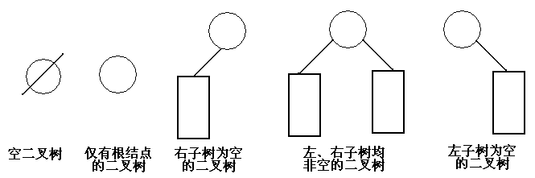

# 二叉树
#### 定义
> 二叉树是度数为2的树。

* 每个结点最多有两个子结点
* 左孩子、右孩子
* 左子树、右子树
* 二叉树一定有序
##### 5种基本形态

#### 性质
>1. 在二叉树的第i层上最多有$2^{i-1}$个结点($i \ge 1)$

证：
当$i=1$时，若二叉树是空树，则第1层有0个结点，否则为1个结点，满足题意。
    
假设当$i=k$时，结论成立，即第$k$层的结点数小于等于$2^{k-1}$。

那么在第$k+1$层，因为二叉树的每个结点最多有2个子结点，所有第k+1层最多有$2^{k-1} \times 2$，即$2^k$个结点。
综上可知，假设成立。

>2. 深度为k的二叉树至多有$2^k-1$个结点($k \ge 1$)。

证：
由1易知结论成立。

特别的，若一颗二叉树深度为k，且有$2^k-1$个结点，则该二叉树称为`满二叉树`。该树的特点是每层上的结点数都是最大结点数。

`完全二叉树`是由满二叉树而引出来的。对于深度为K的，有n个结点的二叉树，当且仅当其每一个结点都与深度为K的满二叉树中编号从1至n的结点一一对应时称之为完全二叉树。

>3. 若一颗二叉树，如果其叶结点数为$n_0$，度为2的结点数为$n_2$,则一定满足:$n_0=n_2+1$。

证：用两种方式计算二叉树中结点的个数。
$n=n_0+n_1+n_2$
$=1 + 0 \times n_0 + 1\times n_1 + 2\times n_2$
整理可得结论。

>4. 具有n个结点的完全二叉树的深度为$\lfloor log_2n \rfloor + 1$。

>5. 对于一棵n个结点的完全二叉树，对任一个结点（编号为i），有：
（1）如果$i=1$，则结点$i$为根，无父节点；如果$i>1$，则其父节点编号为$i/2$。
（2）左孩子编号为$2 \times i$ ( 前提是满足 $2 \times i > n$，否则不存在左孩子)
    右孩子编号为$2 \times i +1$( 前提是满足 $2 \times i + 1> n$，否则不存在右孩子)

 
 
 
 

