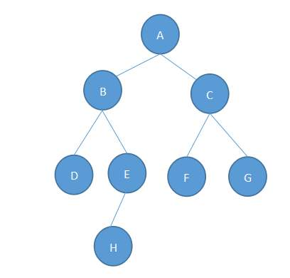
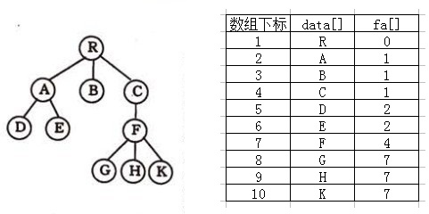

<center> 树的概念 </center>

---


## 一、相关概念
---
### 树的定义
1. 每个元素称为结点（node）
2. 有一个特定的结点，称为根结点或树根（root）
3. 除根结点外，其余结点能分成$m(m \ge 0)$个互不相交的有限集合$T_1,T_2,...T_m$。其中的每个子集又都是一颗树，这些集合称为这棵树的子树。

---


### 子结点

一个结点含有的子树的根结点称为该结点的子结点

---
### 父结点

若一个结点含有子结点，则这个结点称为其子结点的父结点

---


### 兄弟结点
拥有共同父结点的结点互称为兄弟结点

---
### 度
结点的子树数目就是结点的度

---
### 叶子结点
度为零的结点就是叶子结点

---
### 祖先
对任意结点$x$，从根结点到结点$x$的所有结点都是$x$的祖先（结点$x$也是自己的祖先）

---
### 后代
对任意结点$x$，从结点$x$到叶子结点的所有结点都是$x$的后代（结点$x$也是自己的后代）

---
### 路径
对于树中任意两个不同的结点，如果从一个结点出发，自上而下沿着树中连着结点的线段能到达另一结点，便称它们之间存在着一条路径。

---
### 结点深度和层次

对任意结点$x$，$x$结点的深度表示为根结点到$x$结点的路径长度。
（以结点数为长度）
所以根结点深度为1，第二层结点深度为2，以此类推。

从根结点开始，根结点为第一层，根的子结点为第二层，以此类推

---

### （子）树的高度

所有叶结点深度的最大值称为称为（子）树的高度。

---

### 森林
m颗互不相交的树构成的集合就是森林


## 二、树的性质
1. 对于有根树，除根结点外，其余结点有且仅有一个父节点。
2. $n$个结点的树有且仅有$n-1$条边，所有的度之和也等于$n-1$。
3. 树是不存在环的连通图。
4. 树中任意两个结点之间有且仅有一条简单路径。


## 三、树的储存
* 父亲表示法。

```c++
int fa[maxn];
void link (int x, int y) // y是x的父结点
{
    fa[x] = y;
}
```

* 孩子表示法

* 父亲孩子表示法

* 左孩子右兄弟表示法


* 邻接矩阵
```c++
int mp[maxn][maxn];
void link(int x, int y) // 连一条由x指向y的边
{
    mp[x][y] = 1
}

```
* 邻接链表法
```c++
struct Edge
{
    int next;
    int to;
}edge[maxm];

void add_edge(int from, int to)
{
    edge[++m].to = to;
    edge[m].next = head[from];
    head[from] = m;
}

```
