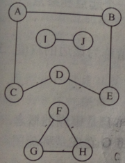
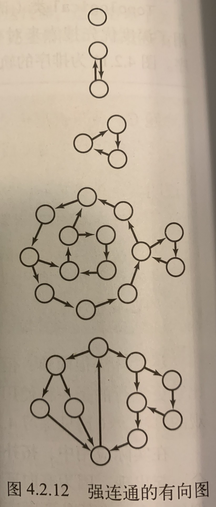
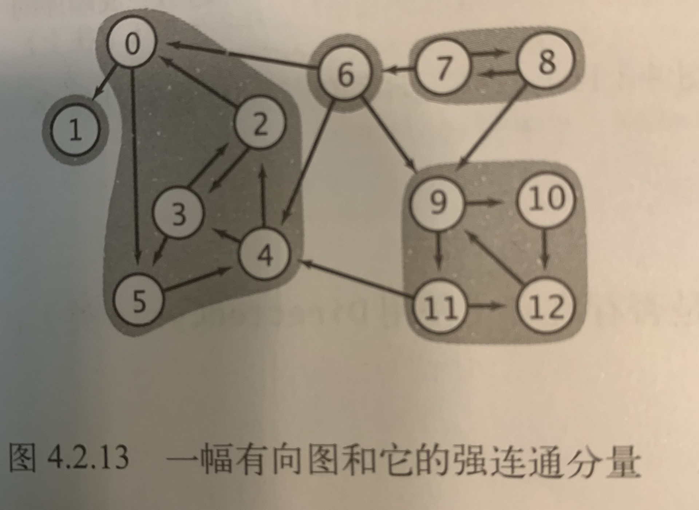

 ### 连通分量


#### 相关概念

##### 无向图
>连通：当两个顶点之间存在一条连接双方的路径时，我们称一个顶点和另一个顶点是连通的。

##### 判断两点是否连通
##### 1.Floyed算法
i,j相连，则dis[i][j]设为true，否则设为false
```c++
for (k = 1; k <= n; k++)
    for (i = 1; i <= n; i++)
        for (j = 1; j <= n; j++)
            dis[i][j] = dis[i][j] || (dis[i][k] && dis[k][j]);
```
#### 2.遍历算法
  可使用DFS实现


### 连通图
>如果从任意一个顶点都存在一条路径到达另一个任意顶点，我们称这幅图是连通图。一副非连通的图由若干连通的部分的部分组成，它们都是其极大连通子图（连通分量）。


例一。求下图的连通分量



###### 利用深度优先搜索求图中的所有连通分量

函数dfs(int V) 第一次调用的参数是顶点V，它会标记所有与V连通的顶点。
主函数的for循环会查找每个没有被标记的顶点并递归调用dfs()来标记和它相邻的所有顶点。
另外，还使用一个以顶点作为索引的数组id[],将同一个连通分量中的顶点和连通分量的标识符关联起来。
```c++
for (int i = 1; i <= n; i++)
{
    if (!vis[i])
    {
        mark++; // 连通分量的标识符，从1开始计数
        dfs(i);
    }
}

void dfs(int v)
{
    vis[v] = 1;  // 标记V为已访问
    id[v] = mark;
    for (int i = head[v]; i; i = edge[v].nxt)
    {
        int y = edge[i].to;
        if (!vis[y])
            dfs(y);
    }
}
```


##### 有向图
* 强连通 
>若两个顶点v和w是互相可达的，则我们称它们为强连通的。也就是说，存在一条从v到w的有向路径，也存在一条从w到v的有向路径。


<br>

* 自反性
 ```任意顶点和其自身是强连通的```

* 对称性
 ```如果v和w连通，那么w和v也是强连通的```

* 传递性
 ```如果v和w是强连通的，且w和x也是强连通的，那么v和x也是强连通的```


强连通图
>一副有向图中的任意两个顶点都是强连通的。

强连通分量
>相互均为强连通的顶点的最大子集



