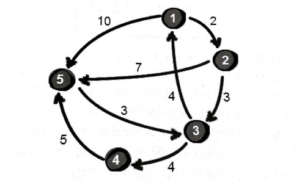
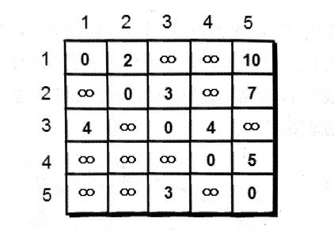
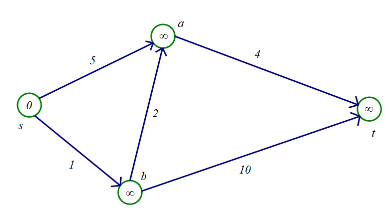

### 最短路径算法


如果所示，求顶点1到顶点5的最短路径





方法1：DFS

```c++
void dfs(int k){ // 搜索从顶点 k 到顶点 n 的路径
    if (k == n){
        // 找到了一条从1到n的路径，do something
        return ;
    }

    for (int i = 1; i <= n; i++){
        if (g[k][i] <= 10000 && !vis[i]){
            res += g[k][i];
            vis[i] = 1;
            dfs(i);
            // 回溯
            vis[i] = 0;
            res -= g[k][i];
        } 
    }
}
```

方法2：Dijkstra算法
1. 初始化dis[1] = 0, 其余结点的dis值设为正无穷大。
2. 找出一个未被标记的，dis值最小的结点x，然后标记x。
3. 扫描结点x的所有出边(x, y, z), 若dis[y]>dis[x] + z, 则使用dis[x] + z更新dis[y]。

重复步骤2，3，直到所有结点都被标记。


```c++
// 使用邻接矩阵
void dijkstra()
{
    memset( dis, 0x3f, sizeof dis );
    dis[s] = 0;

    for (int i = 1; i < n; i++)
    {
        int x = 0;
        for (int j = 1; j <= n; j++)
        {
            if (!vis[j] && (x == 0 || dis[x] > dis[j]))
                x = j;
        }
        vis[x] = 1;
        for (int y = 1; y <= n; y++)
        {
            if (dis[y] > dis[x] + g[x][y])
                dis[y] = dis[x] + g[x][y];
        }
            
    }
}

```


```c++

// 使用邻接表
void dijkstra()
{
    memset( dis, 0x3f, sizeof(dis) );
    dis[s] = 0;

    for (int i = 1; i < n; i++)
    {
        int x = 0;
        for (int j = 1; j <= n; j++)
        {
            if (!vis[j] && (x == 0 || dis[x] > dis[j]))
                x = j;
        }
        vis[x] = 1;
        
        for (int e = head[x]; e; e = edge[e].nxt)
        {
            dis[edge[e].to] = min( dis[edge[e].to], dis[x] + edge[e].ver );
        }
    }
}
```


Dijkstra算法的堆优化
我们建立一个元素为 (dis[x], x) ，（其中，x表示结点编号，dis[x]表示当前所知道的起点到x的距离。）
以dis[x]为关键字的小根堆q。
在初始状态下，堆里只有一个元素（dis[s],s) .（s表示起点，该元素即（0，s）
接下来，在q非空的条件下，取出堆顶元素，对以该元素对应结点的出边进行松弛操作，若dis发生改变，则将新的二元数组入堆。

```c++
memset( dis, 0x3f, sizeof(dis) );
dis[s] = 0;
priority< pair<int, int> > q;
q.push( make_pair(0, 1) );

while ( !q.empty() )
{
    int x = q.top().second; q.pop();

    if (vis[x]) continue;
    vis[x] = 1;

    // 扫描x的所有出边
    for (int i = head[x]; i; i = edge[i].nxt)
    { 
        int y = edge[i].to, w = edge[i].w;  // to 表示第i条边的终点，w表示第i条边的权值
        {
            if (dis[y] > dis[x] + w)
            {
                dis[y] = dis[x] + w;
                q.push( make_pair( -dis[y], y) )
            }
        }
    }
}
```


方法3. Floyed算法
```c++
dis[u][v] = g[u][v] // 初始化：
for ( k = 1; k <= n; k++ )
{
    for ( int i = 1; i <= n; i++ )
    {
        for ( int j = 1; j <= n; j++ )
        {
            if ( dis[i][j] > dis[i][k] + dis[k][j] )
                dis[i][j] = dis[i][k] + dis[k][j];
        }
    }
}
```

方法4. Bellman-Ford算法
起点到终点的最短路径最多n-1条边。
我们对全图的所有边作n-1轮松弛操作



```c++
memset( dis, 0x3f, sizeof(dis) );
dis[s] = 0;
for ( int i = 1; i < n; i++ )
{
    for ( int j = 1; j <= m; j++ ) // 枚举m条边
    {
        if (dis[u] + w[j] < dis[v]) //  u，v分别是第j条边的始点和终点
            dis[v] = dis[u] + w[j];
    }
}
```

BF算法的队列优化（SPFA）
算法实现：
初始时将起点加入队列。
每次取出在队首的结点，取消标记，对所有该结点的出边进行松弛操作，若发生修改，并且边的终点不在队列中，则该终点入队并作标记。队列为空时算法结束。
```c++
void spfa()
{
    memset( dis, 0x3f, sizeof (dis) );
    dis[s] = 0, vis[s] = 1;
    q.push(s);

    while ( !q.empty() )
    {
        int x = q.front(); q.pop();
        vis[x] = 0;
        // 扫描x的所有出边
        for (int i = head[x]; i; i = edge[i].nxt)
        {
            int y = edge[i].to, w = edge[i].w;
            if (dis[y] > dis[x] + w)
            {
                dis[y] = dis[x] + w;
                if (!vis[y])
                {
                    q.push(y);
                    vis[y] = 1;
                }
            }
        } 
    }
}

```


