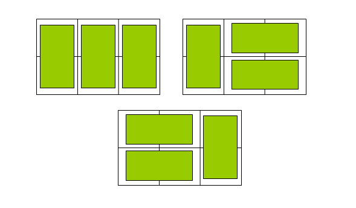

###递推
####例1
>已知数列$\{a_n\}$满足$a_1 = 1$, $a_n=a_{n-1}+3$.现给出$n$的值，输出对应的$a_n$的值。
####例2
>斐波那契数列是指这样的数列，其第一项为1，第二项为1，以后的每一项都是其前两项的和。现给出$n$的值，输出对应的$a_n$的值。

####例3
求证组合数公式
$$C_n^k = C_{n-1}^{k-1} + C_{n-1}^{k}$$

####例3
>在 $2 \times n$ 的一个长方形方格中,用一个 $1 \times 2$ 的骨牌铺满方格,输入 $n$, 输出铺放方案的总数。

####例4
设有一个 $n \times m$ 方格的棋盘$(1 \le m, n \le 100)$
求出该棋盘中包含多少个矩阵。 

####例5
>有如下所示的数塔，要求从顶层走到底层，若每一步只能走到相邻的结点，则经过的结点的数字之和最大是多少？

**输入**
输入数据首先包括一个整数C,表示测试实例的个数，每个测试实例的第一行是一个整数N(1 <= N <= 100)，表示数塔的高度，接下来用N行数字表示数塔，其中第i行有个i个整数，且所有的整数均在区间[0,99]内。
**输出**
对于每个测试实例，输出可能得到的最大和，每个实例的输出占一行。
**测试输入**
1
5 
7 
3 8 
8 1 0 
2 7 4 4 
4 5 2 6 5
**测试输出**
30

####例6
**数的划分问题一**
>把正整数 $N$ 分解成 $M$ 个正整数的和，即使 $M$ 个数相同但顺序不同也认为是不同的方案，要求总方案数。如 $3=1+2$ 跟 $3=2+1$ 是两个不同的方案。

* 状态：$f[i,j]$ 表示把 $i$ 分成 $j$ 个正整数的和的方案数。
* 考虑第一个数取 $x$ 的方案数相当于将剩下的 $i-x$ 分成 $j-1$ 个正整数的方案数。
* $x$ 的范围呢？ 总的结果数呢？
* 隔板法

####例7
**数的划分问题二**
>把正整数 $N$ 分解成 $M$ 个非负整数的和，即使 $M$ 个数相同但顺序不同也认为是不同的方案，要求总方案数。如 $3=1+2$ 跟 $3=2+1$ 是两个不同的方案。
**加数允许为0!**

####例8
**数的划分问题三**
~~自己尝试解决~~
>把正整数 $N$ 分解成 $M$ 个正整数的和，$M$ 个加数相同但顺序不同认为是相同的方案，求方案数。

####例9
>如图，$A$ 点有一个过河卒，需要走到目标 $B$ 点。卒行走规则：可以向下、或者向右。同时在棋盘上的任一点有一个对方的马（如上图的 $C$ 点），该马所在的点和所有跳跃一步可达的点称为对方马的控制点。例如上图 $C$ 点上的马可以控制 9 个点（图中的 $P1，P2 … P8 和 C$ ）。卒不能通过对方马的控制点。

棋盘用坐标表示，$A点(0,0)$、$B点(n,m)$，$n，m$ 为不超过 $20$ 的整数，并由键盘输入），同样马的位置坐标是需要给出的（约定：$C \not=A$，同时 $C \not=B$）。现在要求你计算出卒从 $A$ 点能够到达 $B$ 点的路径的条数。

**输入**
$B$ 点的坐标 $(n,m)$ 以及对方马的坐标 $(X,Y)$。 //不用判错
**输出**
一个整数（路径的条数）。
**样例输入**
6 6 3 2
**样例输出**
17

