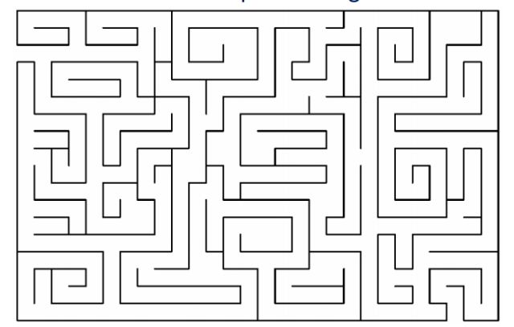

####迷宫

####例1.素数环
>把从 $1$ 到 $10$ 这 $10$ 个数摆成一个环，要求相邻的两个数的和是一个素数。从1开始，按字典序从小到大输出所有的解。

####例2.排列
>设有 $n$ 个整数的集合 ${1,2,…,n}$ ,从中取出任意 $r$ 个数进行排列 $(r < n)$ 试列出所有的排列。

####例3.拆分整数
>把正整数 $N$ 分解成若干个小于 $N$ 正整数的和，加数相同但顺序不同认为是相同的方案，求所有的方案。

例如:
当 $n=7$ 共 $14$ 种拆分方法： 
$7=1+1+1+1+1+1+1$
$7=1+1+1+1+1+2$ 
$7=1+1+1+1+3$ 
$7=1+1+1+2+2 $
$7=1+1+1+4 $
$7=1+1+2+3 $
$7=1+1+5 $
$7=1+2+2+2$ 
$7=1+2+4 $
$7=1+3+3 $
$7=1+6 $
$7=2+2+3$ 
$7=2+5 $
$7=3+4 $

####例4.八皇后
>八皇后问题：要在国际象棋棋盘中放八个皇后，使任意两个皇后都不能互相吃。（提示：皇后能吃同一行、同一列、同一对角线的任意棋子。）

