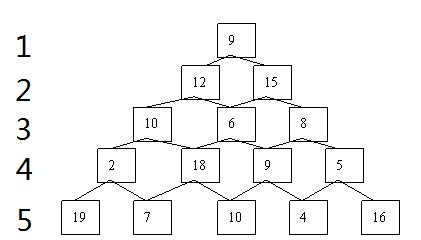

---
marp: true
title: 动态规划
---
<!-- $size: 4:3 -->
<!-- $theme: gaia -->


# 动态规划

* 英语：Dynamic programming，简称DP

* 动态规划常常适用于有重叠子问题和最优子结构性质的问题，动态规划方法所耗时间往往远少于朴素解法。

* 通常许多子问题非常相似，为此动态规划法试图仅仅解决每个子问题一次，从而减少计算量：一旦某个给定子问题的解已经算出，则将其记忆化存储，以便下次需要同一个子问题解之时直接查表。


--- 
# 使用条件
* 最优子结构性质
* 无后效性
* 子问题重叠性质


---
# 最优子结构性质
如果问题的最优解所包含的子问题的解也是最优的，我们就称该问题具有最优子结构性质（即满足最优化原理）。最优子结构性质为动态规划算法解决问题提供了重要线索。

---
# 无后效性
即子问题的解一旦确定，就不再改变，不受在这之后、包含它的更大的问题的求解决策影响。

---
# 子问题重叠性质
子问题重叠性质是指在用递归算法自顶向下对问题进行求解时，每次产生的子问题并不总是新问题，有些子问题会被重复计算多次。动态规划算法正是利用了这种子问题的重叠性质，对每一个子问题只计算一次，然后将其计算结果保存在一个表格中，当再次需要计算已经计算过的子问题时，只是在表格中简单地查看一下结果，从而获得较高的效率。

---
# 三要素：
* 阶段
* 状态
* 决策

---
# 阶段
把一个问题的过程，恰当地分为若干个相互联系的阶段，以便于按一定的次序去求解。描述阶段的变量称为阶段变量。阶段的划分，一般是根据时间和空间的自然特征来进行的，但要便于问题转化为多阶段决策。

---
# 状态
表示每个阶段开始所处的自然状况或客观条件。通常一个阶段有若干个状态（也可能只有一个状态），描述过程状态的变量称为状态变量。

---
# 决策
表示当过程处于某一阶段的某个状态时，可以作出不同的决定，从而确定下一阶段的状态，这种决定称为决策。


---
# 例1 
**求菲波拉契数列的第 n 项。**

状态转移方程（递推关系）：

$f(n)=f(n-1)+f(n-2)$

边界条件：

$f(1)=1,f(2)=2$


---
例2
**数塔**
从上到下，选一条和最大的路径




---
$\begin{matrix} 
9  \\ 
12 & 15 \\ 
10 & 6  & 8 \\
2  & 18 & 9 & 5 \\
19 & 7  & 10 & 4 & 16 
\end{matrix}$
定义状态$f(i,j)$表示从$(1,1)$到$(i,j)$的路径上的数的最大值
状态转移方程：
$f(i, j)= \max\{f(i-1,j-1), f(i-1, j)\} + a[i][j]$
边界条件：
$f(i, 0) = 0, f(0, j) = 0$


----
# 例3  
最长上升子序列LIS
（Longest  Increasing Subsequence）
给定一个长度为$𝑁$的数列，求它数值单调递增的子序列长度最大为多少。

---
即已知有序列$A$， $A=A_1,A_2....，A_n$ ，
求$A$的任意子序列 $B$（ $B=A_{k_1},A_{k_2}....A_{k_p}$ ）,
使$B$满足 $k_1<k_2<....<k_p$ 
且 $B=A_{k_1}<A_{k_2}<....<A_{k_p}$ 。
求$p$的最大值。

---
|i|1|2|3|4|5|6|7|8|
- | :-: | :-: | :-: | :-: | :-: | :-: | :-: | -:
|a[i]|1|7|3|5|9|4|8|6|


 定义状态$g(i)$表示到$a[i]$为止的最长上升子序列 
转移方程：
$g(i)=\max\{g(i-1), f(i)\}$；
其中$f(i)$表示以$a[i]$结尾的LIS。


---
所以我们不如直接定义
状态$f(i)$表示以$a[i]$结尾的LIS。

转移方程：
$$f(i) = \max_{a[j] < a[i], 1\le j < i}\{f(j)\} + 1$$
边界条件：
无
初始值：
$f(i) = 1$


---
```c++
int ans = 0;
for (int i = 1; i <= n; i++)
{
    f[i] = 1;
    for (int j = 1; j < i; j++)
    {
        if (a[j] < a[i])
            f[i] = max(f[i], f[j] + 1);
    }
    ans = max(ans, f[i]);
}
```


---
# 例4 求最长不下降序列
输入样例：
14
13 7 9 16 38 24 37 18 44 19 21 22 63 15
输出样例
max=8
7 9 16 18 19 21 22 63


---
##### 例5 拦截导弹
某国为了防御敌国的导弹袭击，发展出一种导弹拦截系统。但是这种导弹拦截系统有一个缺陷：虽然它的第一发炮弹能够到达任意的高度，但是以后每一发炮弹都不能高于前一发的高度。某天，雷达捕捉到敌国的导弹来袭。由于该系统还在试用阶段，所以只有一套系统，因此有可能不能拦截所有的导弹。
输入导弹依次飞来的高度（雷达给出的高度数据是不大于30000的正整数，导弹数不超过1000），计算这套系统最多能拦截多少导弹，如果要拦截所有导弹最少要配备多少套这种导弹拦截系统。


---
输入样例：
1 7 4 9 4 8 8 2 4
输出样例：
4
3

---
第一问：最长非上升子序列
第二问：


```c++
// a[i] 保存各导弹高度，一共 m 个导弹
// h[i] 保存第 i 套导弹系统所能拦截的导弹系统高度，
// 当前的导弹系统共有n套
n = 0;
for (int i = 1; i <= m; i++)
{
    int x = 0;  // x 用来保存当前导弹应用哪一套拦截系统拦截
    for (int k = 1; k <= n; k++)
    {
        if (h[k] >= a[i])
        {
            if (x == 0)
                x = k;
            else if (h[x] > h[k])
                x = k;
        }
    }
    if (x == 0)
    {
        n++;
        x = n;
    }
    h[x] = a[i];


}


```


<br>
<br>
<br>