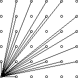

互质定义
>对$\forall a, b \in \mathbb N$，若 $\gcd(a, b)=1$，则称$a, b$互质。

注：$\gcd(a, b, c)=1$称为$a, b, c$互质。注意与三个数两两互质区分。

欧拉函数的定义
>$1～n$中与$n$互质的数的个数称为欧拉函数，记为$ \varphi (N)$。

* 公式1：如果$p$是素数且$k \ge 1$，则
$$\varphi (p^k) = p^k - p^{k - 1}$$
* 公式2： 如果$\gcd(m, n)=1$，那么
$$ \varphi (mn) = \varphi (m)\varphi (n)$$

公式3: 若$N={p_1}^{c_1}{p_2}^{c_2}{p_3}^{c_3}...{p_n}^{c_n}$，其中$p_1, p_2, p_3..., p_n$是质数。
那么$\varphi (N) = N * (1 - 
\frac 1{p_1})* (1 - 
\frac 1{p_2})* (1 - 
\frac 1{p_3})* ... * (1 - 
\frac 1{p_n})$。

求欧拉函数
```c++
int phi(int n)
{
    int ans = n;
    for (int i = 2; i <= sqrt(n); i++)
    {
        if (n % i == 0)
        {
            ans = ans / i * (i - 1);
            while (n % i == 0) n /= i;
        }
    }
    if (n > 1) ans = ans / n * (n - 1);
}
```

### 例  可见的点
在一个平面直角坐标系的第一象限内，如果一个点(x,y)与原点（0,0）的连线中没有通过其他任何点，则称该点在原点处是可见的。

例如，点(4,2)就是不可见的，因为它与原点的连线会通过点(2,1)。

部分可见点与原点的连线如下图所示：




编写一个程序，计算给定整数N的情况下，满足0≤x，y≤N
的可见点（x，y）的数量（可见点不包括原点）。


