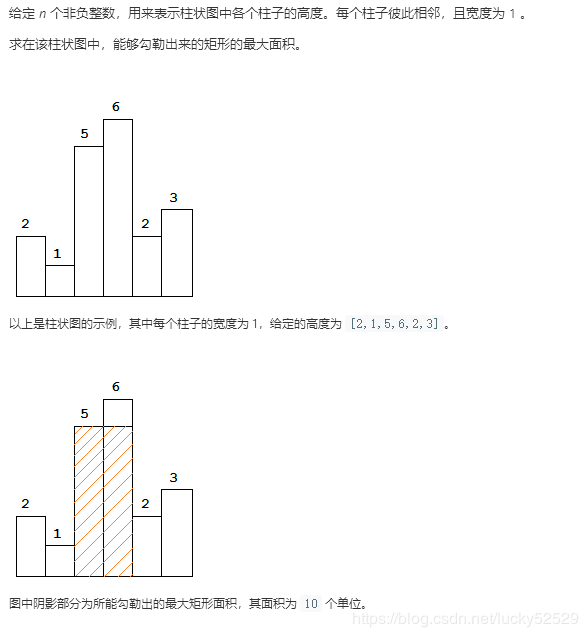

# 单调栈
> 每次新元素入栈后，栈内的元素都保持有序（单调递增或单调递减）。

现在有一组数10，3，7，4，12。从左到右依次入栈，则如果栈为空或入栈元素值小于栈顶元素值，则入栈；否则，如果入栈则会破坏栈的单调性，则需要把比入栈元素小的元素全部出栈。

```c++
stack<int> st;
//此处一般需要给数组最后添加结束标志符，具体下面例题会有详细讲解
for (遍历这个数组)
{
    if (栈空 || 栈顶元素大于等于当前待入栈元素)
    {
        入栈;
    }
    else
    {
        while (栈不为空 && 栈顶元素小于当前元素)
        {
            栈顶元素出栈;
        }
        当前数据入栈;
    }
}
```

#### 例1 视野总和
有n个人站队，所有的人全部向右看，个子高的可以看到个子低的发型，但是会被个子比他高的人给挡住视线，给出每个人的身高，问所有人能看到其他人发型总和是多少。
输入：4 3 7 1
输出：2

题目可转化为找当前数字向右查找的第一个大于他的数字之间有多少个数字，然后将每个结果累计就是答案，

暴力解法：$O(n^2)$

单调栈解法：$O(n)$
我们设立一个栈，并从左到右遍历每一个数字，若栈顶元素小于等于当前元素则更新答案并将当前栈顶元素出栈，直到不满足条件，然后将当前元素入栈。

参考代码
```c++
stack <int> st;
cin >> n;
int x, ans = 0;
for (int i = 1; i <= n; i++) cin >> a[i];
a[n + 1] = 0x7fffffff;

for (int i = 1; i <= n + 1; i++){
    while (!st.empty() && a[st.top()] <= a[i])
    {
        ans += i - st.top() - 1;
        st.pop();
    }
    st.push(i);
}
cout << ans;
```

#### 例2 最大矩形（POJ2559）


#### 例3 求最大区间（POJ 2796：Feel Goo）
描述：给出一组数字（均为正数），求一区间，使得区间元素和乘以区间最小值最大，结果要求给出这个最大值和区间的左右端点
输入：3 1 6 4 5 2
输出：60 3 5