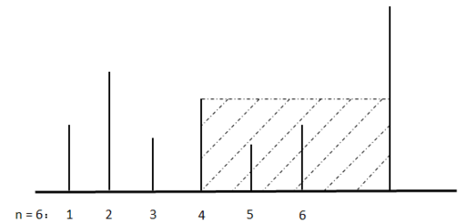

地上从左到右竖立着 $n$ 块木板，从 $1$ 到 $n$ 依次编号，如下图所示。我们知道每块木板的高度，在第 $n$ 块木板右侧竖立着一块高度无限大的木板，现对每块木板依次做如下的操作：对于第 $i$ 块木板，我们从其右侧开始倒水，直到水的高度等于第 $i$ 块木板的高度，倒入的水会淹没 $a_i$ 块木板（如果木板左右两侧水的高度大于等于木板高度即视为木板被淹没），求 $n$ 次操作后，所有 $a_i$ 的和是多少。如图上所示，在第 4 块木板右侧倒水，可以淹没第 5 块和第 6 块一共 2 块木板，$a_4 = 2$。
