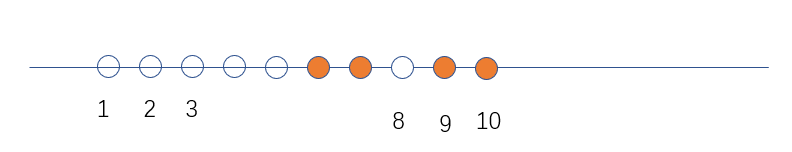

## 超市
首先，我们可以明确一点，在某一段时间，两件商品只能卖一件的话，我们一定会选择卖利润更高的商品，因为倘若我们选择的是利润更低的产品，我们将其替换成利润更高的商品而不会对其他商品有任何影响。该贪心决策称为 ``决策包容性``。
第二点，对于当前我们选择售卖的商品，我们会考虑尽可能晚的出售该商品，这样，对其他商品来说，情况不会变差。这也是 ``决策包容性``。

故我们以如下的算法得到该问题的答案，将所有的商品按照利润从大到小排序，然后依次考虑每件商品，对于当前商品来说，我们从其过期时间开始，向更早的时间寻找未安排售卖商品的最晚时间，该商品便定于该天出售，这样，便可以得到最大收益。时间复杂度 $O(nd_{max})$。

如上图，如果当前处理商品的过期时间为 $10$，那么我们从第十天开始向左寻找最近的空位，图示中为第 $8$ 天，那么，我们便将该商品设为第 $8$ 天出售。同时，将第 $8$ 天对应的小格染色，表示该天已经有商品出售。

为了更快的找到距离当前时间最近的有空的时间。我们建立一个关于 ``天数``  的并查集，每个集合的代表元素表示最近的有空时间，起初每一天各自构成一个集合。对于每件商品，若它在 $d$ 天后过期，就在并查集中查询 $d$ 的树根，记为 $r$。若 $r$ 大于 $0$，在把该商品安排在第 $r$ 天卖出，然后合并 $r$ 和 $r - 1$ 所在的集合。若 $r = 0$，则意味着在 $d$ 天之前已经没有空余的时间安排该件商品。时间复杂度 $O(n\log d)$。